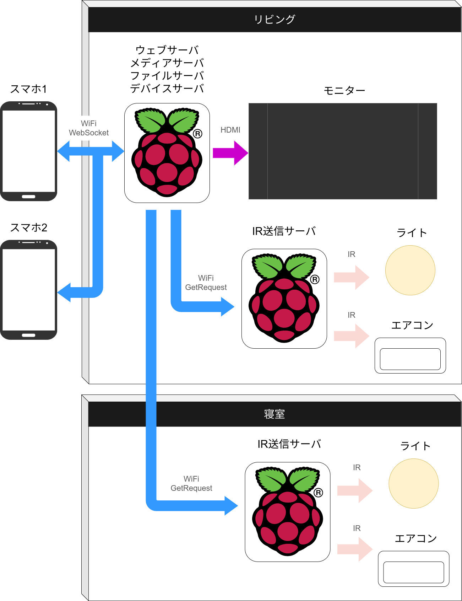
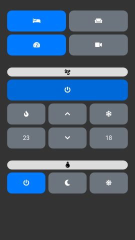
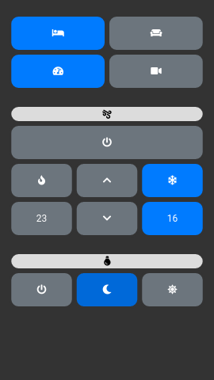
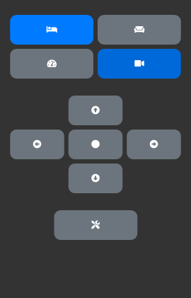
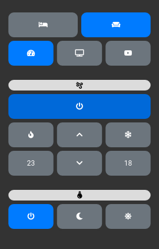
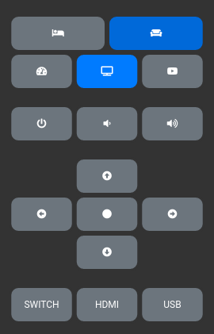
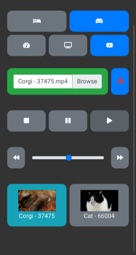

# goMediaServerDemo
# Raspiでスマートリモコンとメディアプレーヤを作成してみた。

raspi上で動くスマートリモコン&メディアプレーヤを作成しました。   
あわせてセットアップ手順も作成しています。   

初心者向けに作成しているつもりなので興味があればレッツトライ！   
ちょっとだけ初期費用はかかりますけど今時の中学生のおこづかいで買えるかもしれません。   
※お父さんのおこづかいで買えるかはわかりません！！   
   

# 全体図

   

# 画面見本
### 寝室のエアコンとライト   
ステータスはデバイスサーバに保存しブラウザ側に同期   

### 寝室のプロジェクタ   
こどものねかしつけに便利な<a href="https://www.segatoys.co.jp/toy/9172/">プロジェクタ</a>  ステータスは持たない   

   

### リビングのエアコンとライトとモニター   
寝室のエアコン/ライトとステータス管理は別   

   

### リビングのメディアプレーヤ  
- 再生/一時停止/停止/バックスキップ/フォワードスキップが可能  
- 再生位置の同期機能
- ファイルアップロード（同一ファイル名はアップロード不可）
- ビデオのタップでスマホ上で再生
- ビデオのロングタップで再生対象か対象外かを切り替え

   

# 機能概要
- raspi4
    - ウェブサーバ・・・スマホと各種機能の仲介処理
    - メディアサーバ・・モニターにビデオを出力。再生状況をウェブサーバ経由でスマホ側に送信。
    - ファイルサーバ・・ファイルを保存。ファイル一覧をウェブサーバ経由でスマホ側に送信。
    - デバイスサーバ・・IR情報を各部屋にあるIR送信サーバに転送。家電情報をウェブサーバ経由でスマホ側に送信。
- raspiZero
    - リビングと寝室に設置。デバイスサーバから送信されたIR情報を赤外線にして家電を操作。
   

# 実装概要
 - raspi4
    - ウェブサーバ・・・go(echo&webSocket), grpc※
    - メディアサーバ・・vlc(libvlc-go), grpc※
    - ファイルサーバ・・ファイル情報をjson保存, grpc※
    - デバイスサーバ・・IR送信サーバへhttp:getリクエストで送信, grpc※   
    ※サーバ間通信

- raspiZero
    - getリクエストで受け取った情報を赤外線に変換して送信   
  

# リンク
## セットアップ
<a href="docs/setup.md">こちら参照</a>
  

## 共通設計
<a href="docs/common_structure.md">こちら参照</a>
  

## サーバ
以下参照   
<a href="backend/ws/docs/readme.md">ウェブサーバ</a>   
<a href="backend/file/docs/readme.md">ファイルサーバ</a>   
<a href="backend/media/docs/readme.md">メディアサーバ</a>   
<a href="backend/device/docs/readme.md">デバイスサーバ</a>   
  

## ブラウザ
<a href="public/docs/readme.md">こちら参照</a>
  

## 引用元
参考にした記事はたくさんあるのですが、メモってませんでした。。。
